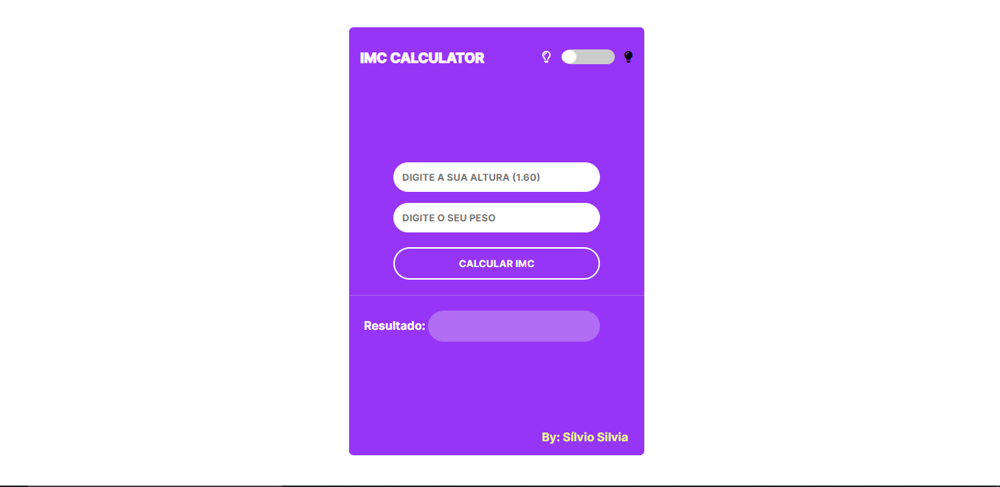

# IMC-Calculator
<h1>O Que é IMC?</h1>

Índice de Massa Corporal, é a quantidade de massa corporal que uma pessoa possui

<h1>O que Faz?</h1>
<b>Este Programa simples ajuda a fazer o cálculo exato da sua massa corporal, com base nas suas especificações físicas</b>
<h1>Tech's Usadas </h1>

HTML5

CSS3 (Flexbox)

Javascipt

<h1>Implementações</h1>

Dark Mode

Light Mode

<h1>Demo</h1>
<b>Dark Mode </b>

<b>Light Mode</b>

